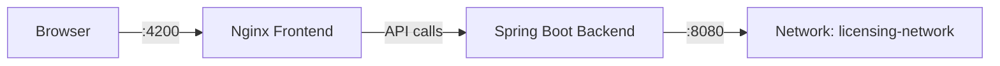
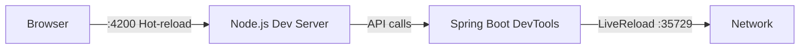

# 🐳 Guide Docker - Licensing Cloud System

## 📋 Prérequis

- **Docker** version 20.10 ou supérieure
- **Docker Compose** version 2.0 ou supérieure
- **4GB RAM minimum** alloués à Docker

Vérifiez les versions installées :
```bash
docker --version
docker compose version
```

## 🚀 Démarrage Rapide

### Mode Production

Une seule commande pour tout démarrer :

```bash
docker compose up
```

Avec rebuild (si vous avez modifié le code) :
```bash
docker compose up --build
```

En arrière-plan (detached mode) :
```bash
docker compose up -d
```

### Mode Développement (avec hot-reload)

Pour le développement avec rechargement automatique :

```bash
docker compose -f docker-compose.dev.yml up
```

## 🌐 Accès aux Services

Une fois les conteneurs démarrés :

| Service | URL | Description |
|---------|-----|-------------|
| **Frontend** | http://localhost:4200 | Application Angular |
| **Backend API** | http://localhost:8080/api | API REST Spring Boot |
| **Health Check Frontend** | http://localhost:4200/health | Status du frontend |
| **Health Check Backend** | http://localhost:8080/actuator/health | Status du backend |

## 📁 Structure Docker

```
.
├── Dockerfile                 # Image production frontend
├── docker-compose.yml         # Configuration production
├── docker-compose.dev.yml     # Configuration développement
├── nginx.conf                 # Configuration Nginx
├── .dockerignore             # Fichiers ignorés par Docker
└── DOCKER_README.md          # Ce fichier
```

## 🔧 Configuration

### Variables d'Environnement

#### Frontend
- `API_URL` : URL du backend (par défaut: `http://backend:8080/api`)

#### Backend
- `SPRING_PROFILES_ACTIVE` : Profil Spring (docker/dev)
- `SERVER_PORT` : Port du serveur (8080)
- `CORS_ALLOWED_ORIGINS` : Origins autorisées pour CORS

### Modifier l'URL de l'API

Pour changer l'URL de l'API backend, éditez `docker-compose.yml` :

```yaml
frontend:
  environment:
    - API_URL=http://votre-backend:8080/api
```

## 📦 Commandes Docker Utiles

### Démarrage et Arrêt

```bash
# Démarrer les services
docker compose up

# Démarrer en arrière-plan
docker compose up -d

# Arrêter les services
docker compose down

# Arrêter et supprimer les volumes
docker compose down -v
```

### Logs et Monitoring

```bash
# Voir tous les logs
docker compose logs

# Suivre les logs en temps réel
docker compose logs -f

# Logs d'un service spécifique
docker compose logs frontend
docker compose logs backend

# Logs avec timestamp
docker compose logs -f --timestamps
```

### Gestion des Conteneurs

```bash
# Lister les conteneurs
docker compose ps

# Redémarrer un service
docker compose restart frontend
docker compose restart backend

# Reconstruire les images
docker compose build

# Reconstruire sans cache
docker compose build --no-cache
```

### Nettoyage

```bash
# Supprimer les conteneurs arrêtés
docker compose down

# Supprimer conteneurs, networks, et volumes
docker compose down -v

# Nettoyer Docker complètement
docker system prune -a
```

## 🔍 Debug et Troubleshooting

### Vérifier l'état des services

```bash
# Status des conteneurs
docker compose ps

# Health check
docker compose exec frontend wget -qO- http://localhost/health
docker compose exec backend curl -f http://localhost:8080/actuator/health
```

### Accéder à un conteneur

```bash
# Shell dans le frontend
docker compose exec frontend sh

# Shell dans le backend
docker compose exec backend sh

# Exécuter une commande
docker compose exec frontend ls -la /usr/share/nginx/html
```

### Problèmes Courants

#### 1. Port déjà utilisé

**Erreur** : `Bind for 0.0.0.0:4200 failed: port is already allocated`

**Solution** :
```bash
# Trouver le processus utilisant le port
lsof -i :4200
# ou
netstat -ano | findstr :4200

# Tuer le processus ou changer le port dans docker-compose.yml
```

#### 2. Backend ne démarre pas

**Solution** :
```bash
# Vérifier les logs
docker compose logs backend

# Vérifier que le wrapper Maven/Gradle existe
docker compose exec backend ls -la

# Rendre le wrapper exécutable si nécessaire
chmod +x ../backend/mvnw  # ou gradlew
```

#### 3. Frontend ne se connecte pas au backend

**Solution** :
```bash
# Vérifier la connectivité réseau
docker compose exec frontend ping backend

# Vérifier les variables d'environnement
docker compose exec frontend env | grep API_URL
```

#### 4. Rebuild nécessaire après modification

```bash
# Reconstruire et redémarrer
docker compose up --build
```

## 🏗 Architecture Docker

### Mode Production



**Frontend** :
- Build multi-stage avec Node.js
- Servi par Nginx (léger et performant)
- Optimisé pour la production

**Backend** :
- Image OpenJDK 21
- Auto-détection Maven/Gradle
- Health checks configurés

### Mode Développement



**Avantages** :
- ✅ Hot-reload frontend et backend
- ✅ Volumes montés pour modifications en temps réel
- ✅ Pas de rebuild nécessaire

## 📊 Health Checks

Les services incluent des health checks automatiques :

**Frontend** :
- Endpoint : `/health`
- Intervalle : 30s
- Timeout : 10s

**Backend** :
- Endpoint : `/actuator/health`
- Intervalle : 30s
- Timeout : 10s
- Start period : 60s (temps de démarrage Spring Boot)

```bash
# Vérifier manuellement
curl http://localhost:4200/health
curl http://localhost:8080/actuator/health
```

## 🔐 Sécurité

### Headers de Sécurité (Nginx)

Le frontend inclut automatiquement :
- `X-Frame-Options: SAMEORIGIN`
- `X-Content-Type-Options: nosniff`
- `X-XSS-Protection: 1; mode=block`

### CORS

Le backend doit autoriser les origins :
- `http://localhost:4200` (développement)
- `http://localhost` (production Docker)

Configuration Spring Boot :
```java
@Configuration
public class CorsConfig {
    @Value("${cors.allowed.origins}")
    private String allowedOrigins;

    @Bean
    public WebMvcConfigurer corsConfigurer() {
        return new WebMvcConfigurer() {
            @Override
            public void addCorsMappings(CorsRegistry registry) {
                registry.addMapping("/api/**")
                        .allowedOrigins(allowedOrigins.split(","))
                        .allowedMethods("GET", "POST", "PUT", "DELETE")
                        .allowedHeaders("*");
            }
        };
    }
}
```

## 🎯 Scénarios d'Utilisation

### 1. Premier Démarrage

```bash
# 1. Cloner le projet
cd /Users/satiguiberthe/Desktop/Dev/frontend/quantech_test

# 2. Démarrer les services
docker compose up --build

# 3. Attendre que les services soient healthy
# Frontend: http://localhost:4200
# Backend: http://localhost:8080
```

### 2. Développement Actif

```bash
# Mode dev avec hot-reload
docker compose -f docker-compose.dev.yml up

# Dans un autre terminal - modifier le code
# Les changements sont automatiquement détectés
```

### 3. Tests de Production

```bash
# Build et démarrage production
docker compose up --build -d

# Tester l'application
curl http://localhost:4200
curl http://localhost:8080/api/licenses

# Arrêter
docker compose down
```

### 4. CI/CD

```bash
# Build et test
docker compose build
docker compose up -d
docker compose exec backend ./mvnw test
docker compose exec frontend npm test

# Cleanup
docker compose down -v
```

## 📈 Performance

### Optimisations Nginx

- **Gzip** : Compression des assets
- **Cache** : 1 an pour les fichiers statiques
- **HTTP/2** : Supporté par défaut

### Métriques

```bash
# Utilisation des ressources
docker stats

# Taille des images
docker images | grep licensing
```

## 🔄 Mise à Jour

### Mise à jour du Code

```bash
# 1. Pull les dernières modifications
git pull

# 2. Rebuild les images
docker compose build --no-cache

# 3. Redémarrer
docker compose up -d
```

### Mise à jour des Dépendances

```bash
# Frontend
docker compose exec frontend npm update

# Backend
docker compose exec backend ./mvnw clean install
```

## 📝 Logs Persistants

Pour conserver les logs :

```yaml
# Ajouter dans docker-compose.yml
services:
  backend:
    logging:
      driver: "json-file"
      options:
        max-size: "10m"
        max-file: "3"
```

## 🎓 Best Practices

1. ✅ **Toujours utiliser** `docker compose down` avant de rebuild
2. ✅ **Utiliser** `.dockerignore` pour exclure node_modules
3. ✅ **Vérifier** les health checks avec `docker compose ps`
4. ✅ **Utiliser** le mode dev pour le développement
5. ✅ **Builder** avec `--no-cache` si problèmes de cache
6. ✅ **Monitorer** les logs avec `docker compose logs -f`

## 🆘 Support

### Problèmes Backend

Si le backend ne trouve pas Maven/Gradle :

```bash
# Vérifier que le wrapper existe
ls -la ../backend/mvnw
ls -la ../backend/gradlew

# Le rendre exécutable
chmod +x ../backend/mvnw
```

### Problèmes Frontend

```bash
# Nettoyer le cache npm
docker compose exec frontend npm cache clean --force

# Réinstaller les dépendances
docker compose exec frontend rm -rf node_modules
docker compose up --build
```

## 📞 Commandes Rapides

```bash
# Démarrage rapide
docker compose up -d

# Logs en temps réel
docker compose logs -f

# Redémarrage complet
docker compose down && docker compose up --build -d

# Nettoyage total
docker compose down -v && docker system prune -a
```

---

**Dernière mise à jour** : 24 Novembre 2025
**Docker Compose Version** : 3.8
**Status** : ✅ Production Ready

🐳 **Votre système de licensing cloud est maintenant conteneurisé !**
